<h1 align="center">
  <u><a href="https://scholars-iq-200.vercel.app/"><ins>ScholarsIQ200<ins></a>🎓</u>
</h1>

A **multimodal chatbot** with **Retrieval-Augmented Generation (RAG)** and **tool-calling**, built for the Ed-Tech domain. Ask questions in text or images, get answers grounded in a course knowledge base, search the live web, and test yourself with AI-generated interactive quizzes.


---

## ✨ Features

| Capability | How it works |
|---|---|
| 🖼️ **Multimodal input** | Speak/type a question and/or upload an image (a photo of a problem, a diagram, handwriting). |
| 🎙️ **Voice input** | Tap the mic to dictate your question. The recorded audio is transcribed by Groq Whisper (`whisper-large-v3-turbo`). |
| 📚 **RAG** | Each question retrieves relevant passages from a vector knowledge base (Upstash Vector) and grounds the answer in them. |
| 🔍 **Tool-calling (web search)** | The model can call a `searchWeb` tool (Tavily) for current information beyond the course material. |
| 🧩 **Generative UI (quizzes)** | The model can call a `createQuiz` tool; the app renders an **interactive multiple-choice quiz** with instant feedback and scoring. |
| 🎨 **Polished UI** | Streaming responses, Markdown + code highlighting, image previews, tool-activity chips, light/dark mode, fully responsive. |
| ⬇️ **Export Chat As PDF** | Download the entire conversation as PDF in just 1-click. |

---

## 🏗️ Architecture

```mermaid
flowchart TD

subgraph group_client["Client Experience"]
  node_workspace["Tutor chat workspace<br/>Client UI"]
  node_voice["Voice input control<br/>Client control"]
  node_renderer["Conversation message renderer<br/>Client renderer"]
  node_sources["Retrieved‑source cards<br/>Client component"]
  node_webresults["Web‑result cards<br/>Client component"]
  node_quiz["Interactive quiz card<br/>Client component"]
end

subgraph group_chat["Chat Orchestration"]
  node_chatendpoint["Streaming chat endpoint<br/>API endpoint"]
  node_prompt["Grounded tutor prompt builder<br/>[prompts.ts]"]
  node_groqrouter["Groq model router<br/>[groq.ts]"]
  node_tools["AI tool catalogue<br/>Tool registry"]
  node_transcribe["Speech transcription endpoint<br/>API endpoint"]
end

subgraph group_retrieval["Retrieval and Tools"]
  node_vectorretrieve["Course‑passage retrieval<br/>Retrieval service"]
  node_tavilyadapter["Tavily search adapter<br/>[tavily.ts]"]
end

subgraph group_provisioning["Knowledge Provisioning"]
  node_corpus["Course Markdown corpus<br/>Knowledge source"]
  node_ingest["Knowledge‑base ingestion CLI<br/>[ingest.ts]"]
end

subgraph group_external["External Systems"]
  node_learner(("Learner/browser<br/>External actor"))
  node_upstash[("Upstash Vector<br/>External vector index")]
  node_tavily["Tavily Search API<br/>External search API"]
  node_groqapi["Groq API<br/>External AI API"]
  node_operator(("Developer/operator<br/>External actor"))
end

node_learner -->|"submits content"| node_workspace
node_workspace -->|"sends messages"| node_chatendpoint
node_workspace -->|"renders messages"| node_renderer
node_learner -->|"records input"| node_voice
node_voice -->|"sends audio"| node_transcribe
node_transcribe -->|"transcribes speech"| node_groqapi
node_chatendpoint -->|"retrieves passages"| node_vectorretrieve
node_vectorretrieve -->|"reads passages"| node_upstash
node_chatendpoint -->|"builds prompt"| node_prompt
node_chatendpoint -->|"routes inference"| node_groqrouter
node_groqrouter -->|"calls model"| node_groqapi
node_chatendpoint -.->|"registers tools"| node_tools
node_tools -->|"executes search"| node_tavilyadapter
node_tavilyadapter -->|"searches web"| node_tavily
node_chatendpoint -->|"streams response"| node_workspace
node_renderer -->|"renders sources"| node_sources
node_renderer -->|"renders web results"| node_webresults
node_renderer -->|"renders quiz"| node_quiz
node_operator -->|"starts ingestion"| node_ingest
node_ingest -->|"reads documents"| node_corpus
node_ingest -->|"upserts chunks"| node_upstash

click node_workspace "https://github.com/trailblazer09/scholarsiq200/blob/main/app/page.tsx"
click node_voice "https://github.com/trailblazer09/scholarsiq200/blob/main/components/VoiceButton.tsx"
click node_renderer "https://github.com/trailblazer09/scholarsiq200/blob/main/components/ChatMessage.tsx"
click node_sources "https://github.com/trailblazer09/scholarsiq200/blob/main/components/SourceCards.tsx"
click node_webresults "https://github.com/trailblazer09/scholarsiq200/blob/main/components/WebResults.tsx"
click node_quiz "https://github.com/trailblazer09/scholarsiq200/blob/main/components/QuizCard.tsx"
click node_chatendpoint "https://github.com/trailblazer09/scholarsiq200/blob/main/app/api/chat/route.ts"
click node_prompt "https://github.com/trailblazer09/scholarsiq200/blob/main/lib/prompts.ts"
click node_groqrouter "https://github.com/trailblazer09/scholarsiq200/blob/main/lib/groq.ts"
click node_tools "https://github.com/trailblazer09/scholarsiq200/blob/main/lib/tools.ts"
click node_transcribe "https://github.com/trailblazer09/scholarsiq200/blob/main/app/api/transcribe/route.ts"
click node_vectorretrieve "https://github.com/trailblazer09/scholarsiq200/blob/main/lib/vector.ts"
click node_tavilyadapter "https://github.com/trailblazer09/scholarsiq200/blob/main/lib/tavily.ts"
click node_corpus "https://github.com/trailblazer09/scholarsiq200/tree/main/data"
click node_ingest "https://github.com/trailblazer09/scholarsiq200/blob/main/scripts/ingest.ts"

classDef toneNeutral fill:#f8fafc,stroke:#334155,stroke-width:1.5px,color:#0f172a
classDef toneBlue fill:#dbeafe,stroke:#2563eb,stroke-width:1.5px,color:#172554
classDef toneAmber fill:#fef3c7,stroke:#d97706,stroke-width:1.5px,color:#78350f
classDef toneMint fill:#dcfce7,stroke:#16a34a,stroke-width:1.5px,color:#14532d
classDef toneRose fill:#ffe4e6,stroke:#e11d48,stroke-width:1.5px,color:#881337
classDef toneIndigo fill:#e0e7ff,stroke:#4f46e5,stroke-width:1.5px,color:#312e81
classDef toneTeal fill:#ccfbf1,stroke:#0f766e,stroke-width:1.5px,color:#134e4a
class node_workspace,node_voice,node_renderer,node_sources,node_webresults,node_quiz toneBlue
class node_chatendpoint,node_prompt,node_groqrouter,node_tools,node_transcribe toneAmber
class node_vectorretrieve,node_tavilyadapter toneMint
class node_corpus,node_ingest toneRose
class node_learner,node_upstash,node_tavily,node_groqapi,node_operator toneIndigo
```

---

```
                    ┌────────────────────────────────────────────┐
   Browser  ───────▶│  Next.js App Router (React 19)            │
   (chat UI,        │  • useChat (Vercel AI SDK)                 │
    image upload)   │  • streaming, image previews, quizzes      │
                    └───────────────┬────────────────────────────┘
                                    │  POST /api/chat (serverless)
                                    ▼
                    ┌────────────────────────────────────────────┐
                    │  Route handler                             │
                    │  1. Retrieve context  ──▶ Upstash Vector   │  ← RAG
                    │  2. streamText (Groq) — vision or tool     │
                    │     model chosen by whether an image is in │
                    │     the request                            │
                    │  3. Tools: searchWeb (Tavily), createQuiz  │  ← tool-calling
                    │  4. Stream text + sources + tool results   │
                    └────────────────────────────────────────────┘
```

Everything runs **serverless**. RAG sources are streamed to the client as a custom data part; tool results are streamed and rendered as rich components.

---

## 🧰 Tech Stack

- **Framework:** Next.js 16 (App Router) + React 19 + TypeScript
- **AI:** [Vercel AI SDK](https://ai-sdk.dev) v6 (`ai`, `@ai-sdk/react`)
- **LLM:** [Groq](https://groq.com) — model routing:
  - `meta-llama/llama-4-scout-17b-16e-instruct` (multimodal) for image queries
  - `qwen/qwen3-32b` for text queries (reliable native tool-calling; reasoning hidden)
- **Vector DB / RAG:** [Upstash Vector](https://upstash.com) (built-in embeddings)
- **Web search:** [Tavily](https://tavily.com)
- **UI:** Tailwind CSS v4, Framer Motion, lucide-react, react-markdown

---

## 📁 Project Structure

```
.
├── app/
│   ├── api/chat/route.ts        # Main chat endpoint: RAG + streaming + tools
│   ├── api/transcribe/route.ts  # Voice → text (Groq Whisper)
│   ├── layout.tsx               # Root layout + theme bootstrap
│   ├── page.tsx                 # Chat UI (messages + composer)
│   └── globals.css              # Tailwind v4 + design tokens
├── components/               # ChatMessage, QuizCard, SourceCards, VoiceButton, Brand, …
├── lib/
│   ├── groq.ts               # Groq provider + model id
│   ├── vector.ts             # Upstash Vector retrieval
│   ├── tavily.ts             # Web search
│   ├── tools.ts              # AI SDK tool definitions
│   ├── prompts.ts            # System prompt (injects RAG context)
│   └── utils.ts
├── data/                     # Sample Ed-Tech knowledge base (Markdown)
├── scripts/ingest.ts         # Chunk + upload docs to Upstash Vector
└── .env.example
```

---

## 🚀 Getting Started (Local)

### 1. Prerequisites
- Node.js 18+ and npm
- Free accounts: [Groq](https://console.groq.com), [Upstash](https://console.upstash.com) (and optionally [Tavily](https://app.tavily.com))

### 2. Install
```bash
git clone <your-repo-url>
cd scholarsiq200
npm install
```

### 3. Configure environment
Copy the example and fill in your keys:
```bash
cp .env.example .env.local
```
```env
GROQ_API_KEY=gsk_...
UPSTASH_VECTOR_REST_URL=https://...-vector.upstash.io
UPSTASH_VECTOR_REST_TOKEN=...
TAVILY_API_KEY=tvly-...   # optional
```

> **Important — Upstash setup:** When creating your Upstash Vector index, choose an **embedding model** (e.g. `bge-large-en-v1.5` or `mixedbread-large`). This lets the index embed raw text automatically, so no separate embeddings API is needed.

### 4. Load the knowledge base (RAG)
```bash
npm run ingest
```
This chunks the Markdown files in `/data` and uploads them to Upstash Vector.

### 5. Run
```bash
npm run dev
```
Open [http://localhost:3000](http://localhost:3000).

---

## ☁️ Deploy to Vercel

1. Push this repo to GitHub.
2. Go to [vercel.com/new](https://vercel.com/new) and import the repo.
3. Add the environment variables (`GROQ_API_KEY`, `UPSTASH_VECTOR_REST_URL`, `UPSTASH_VECTOR_REST_TOKEN`, optionally `TAVILY_API_KEY`) in **Project → Settings → Environment Variables**.
4. Deploy. Vercel auto-detects Next.js — no extra config needed.
5. **Run the ingest script once** (locally, pointing at the same Upstash index) so the deployed app has data to retrieve:
   ```bash
   npm run ingest
   ```

Your chatbot is now live at `https://<your-project>.vercel.app`.

---

## 🎬 Demo Guide — what to try

1. **RAG (grounded answer with citations)**
   > "Explain photosynthesis using my notes."
   The answer cites `[Source N]` and you can expand the **source cards** to see the retrieved passages.

2. **Multimodal (vision)**
   Click the 🖼️ icon, upload a photo of a maths problem or a diagram, and ask:
   > "Solve this step by step."

3. **Tool-calling (web search)**
   > "What are the latest breakthroughs in AI?"
   Watch the **"Searching the web…"** chip, then linked results appear.

4. **Generative UI (interactive quiz)**
   > "Quiz me on Newton's laws of motion."
   An **interactive quiz** renders — click answers to get instant feedback and a score.

5. **Voice input**
   Tap the 🎙️ mic, speak your question, then stop — Groq Whisper transcribes it into the input box.

The sample knowledge base covers: photosynthesis, Newton's laws, the Pythagorean theorem, neural networks, and the water cycle. Add your own `.md` files to `/data` and re-run `npm run ingest`.

6. **PDF Export**
   Tap the download icon to export the live chat.

---

## 🔧 How RAG works here

1. The latest user message is used as a query.
2. `lib/vector.ts` queries Upstash Vector (`data` field → built-in embedding) and returns the top passages above a similarity threshold.
3. Passages are injected into the system prompt (`lib/prompts.ts`) **and** streamed to the UI as citation cards.
4. The model answers grounded in that context and cites the sources.

---

## ⚠️ Notes & Limitations

- The app degrades gracefully: without Upstash it skips RAG, without Tavily the web-search tool reports it's not configured.
- Quiz quality depends on the model; questions are model-authored.
- Free-tier rate limits apply (Groq, Upstash, Tavily).

